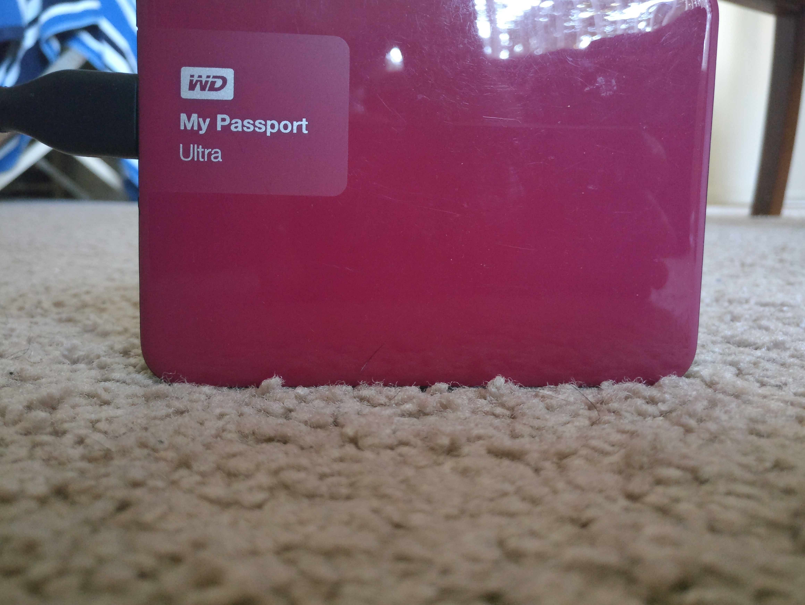

<h1 align=center> ENPM808X - Robot Butler </h1>
<p align="center">
<a href="https://travis-ci.org/karanvivekbhargava/robot-butler-enpm808x">

</a>
<a href='https://coveralls.io/github/karanvivekbhargava/robot-butler-enpm808x?branch=master'></a>
<a href='https://opensource.org/licenses/MIT'></a>
</p>

<p align="center">

Reference for image: <a href='http://www.savioke.com/'>link</a>
</p>

## Project Overview

The Butler product by Acme Robotics is one of its flagship products. It performs best for an environment where things are to be transported to and fro from one area to another. Equipped with a 16MP camera and the best of class custom lidar sensor, its the best offering one can hope for. The butler has intelligent algorithms running under its hood which allow it to percieve its environment by using these sensors. This allows the butler to avoid hitting obstacles and helps it serve you better.

## New Feature List
The new offerings in software are included below.
* Estimation of object distances using camera data: While other companies are defining state of the art algorithms on the road, the butler does it indoors. Making the robots less likely to crash into objects than the competitors.
* Using lidar to map your environment: The butler records its surroundings in 3D so that it can see obstacles before they hit it.
* Advanced data fusion algorithms: This robot is cool but don't be fooled by its innocent appearance, it works super hard on the inside to crunch numbers faster than ever. Combining the data from both the sensors, it gets a better estimate on how it should move.
* Path Planning: Using our custom sensors and the fusion technique, the butler can plan the path better to avoid obstacles

---
## The Camera
The butler has a 16MP front facing camera. Its camera module consists of an FPGA which can perform custom algorithms at a mind boggling pace. Once the input image arrives, the module does a perspective transform on it. This gives us a birds eye view which is then passed to a thresholder. The binarized image from the thresholder is then used to calculate the probabilities of hitting the nearby obstacles. We use a gaussian probability distribution to compute the same.

The images below show how the camera module is manupulating the data to translate it into a probability. The left image is the input, the center image is the perspective warped image and the right image is the thresholded image after warping. After this I'm checking the distances to obstacles with different headding directions. I can use these distances to obtain probabilties using a gaussian distribution.
<p align="center">


</p>

## The Lidar
The lidar gives a three dimensional point cloud representation of its surroundings. It uses this information and 'flattens' it out. This results in all the points being in some eucledean plane and the robot being the origin. It computes the distances from the obstacles and returns gaussian probabilitites to all the possible heading directions of the robot.

Example: Consider that we have a point from the point cloud as below. PS: The points are preprocessed to be in the heading directions that we are going to consider.
```
p = (1, 2, 3)
```
The points will be flattened at first, this results in the representation of the points on the ground (euclidean plane).
```
p_flattened = (1, 2)
```
We will then compute the distances of the points from the origin (this is where the robot will be at all times)
```
d = sqrt(1^2 + 2^2)
```
We then turn these distances into the probabilities of hitting an obstacle by
```
Probability = C*e^((d-mean)/(2*variance))
```
Where C is a normalization constant, mean is 0 and variance is tuned according to the data. The lidar outputs these probabilites.

## Sensor Fusion
After the camera and lidar do the hard work of putting the information in a sensible format, the sensor fusion module takes the two readings and selects the higher probability of the two, for each heading direction. Although this might result in some noisy outputs, it avoids obstacles effectively.

Example: If say we have the incoming probabilities given below where the probabilities correspond to heading directions -50, -30, -10, 10, 30, 50 degrees from current heading direction.
```
P_image = [0.1, 0.2, 0.3, 0.4, 0.5, 0.6];
P_lidar = [0.6, 0.5, 0.4, 0.3, 0.2, 0,1];
```
Fused probability is given by
```
P_fusion = max(P_image, P_lidar)
```
Which gives us,
```
P_fusion = [0.6, 0.5, 0.4, 0.4, 0.5, 0.6];
```

## Path Planning
The path planner uses the fused sensor output to determine what should be the next heading direction. This is done by selecting the heading direction which results in the least probability of hitting any obstacles.

Example: If the incoming fused probabilities are as given below
```
P_fused = [0.1, 0.2, 0.0, 0.01, 0.1, 0,3];
```
Then the path planner can be written mathematically as
```
direction = argmin_x( P_fused[x] )
```
Then the output of the path planner would be
```
direction = 2 (index of 0.0)
```

The robot later converts this direction into an angle by using

```
angle = (direction - 2.5)*20.0;
```

## The Robot
The robot is the class which uses all the other modules and creates instances of a camera, lidar, sensor fusion module and path planning module. It then uses the modules to run.
<p align="center">

</p>

---
## Results

The software takes the camera image as well as the processed point cloud. I've configured the robot for three pictures by generating the respective lidar inputs.

Following are the results
1. Obstacle on the left
<p align="center">

</p>

```
Output:
[OK] Diagnostics are fine.
Rotate robot counter clockwise by -10

```

2. Obstacle in the center
<p align="center">

</p>

```
Output:
[OK] Diagnostics are fine.
Rotate robot counter clockwise by 50
```

3. Obstacle on the right 
<p align="center">

</p>

```
Output:
[OK] Diagnostics are fine.
Rotate robot counter clockwise by -50
```

---
## Solo Iterative Process Overview
Click this link to view the product backlog, time sheets, defect logs and release backlog - [link](https://docs.google.com/spreadsheets/d/1WOvV6iL4gGOF8Qacwj2R3Lom71wziKXEf_UEhdGfOuY/edit?usp=sharing)

Care has been taken to design the SIP tasks such that they have a direct relation to the previous tasks. This helps in better time estimation. For instance, the change in time taken for stub implementation is proportional to the change in time taken to implement the methods. This gave me a good idea to rethink about the allotment of time for future tasks.

---
## Dependencies

The butler software stack has the following dependencies:
* cmake
* googletest
* opencv

To install opencv, follow the instructions on [link](https://docs.opencv.org/trunk/d7/d9f/tutorial_linux_install.html)

## How to build - standard install via command-line
```
git clone --recursive https://github.com/karanvivekbhargava/robot-butler-enpm808x
cd <path to repository>
mkdir build
cd build
cmake ..
make
```

## How to run demo

After following the installation instructions above, you can try three different images from the data folder by specifying the argument with the program

To run for image_left.jpg, kindly enter the function below
```
./app/shell-app left
```
To run for image_center.jpg, kindly enter the function below
```
./app/shell-app center
```
To run for image_right.jpg, kindly enter the function below
```
./app/shell-app right
```

## How to run tests

After following the building instructions, run the command below
```
./test/cpp-test
```

## How to generate documentation

Although the repository contains the documentation, if you'd still like to generate it then follow the instructions below.

```
sudo apt-get install doxygen
sudo apt-get install doxywizard
doxywizard
```

Once doxywizard is open, select the workspace as the repository. Fill in the details as required and set the source code folder to the repository as well. Create a new folder in the repository and select that as the destination directory. Proceed with the default settings and generate the documentation.

Alternatively, you can run

```
doxygen -g doxygenconfig
doxygen doxygenconfig
```